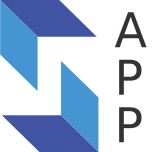
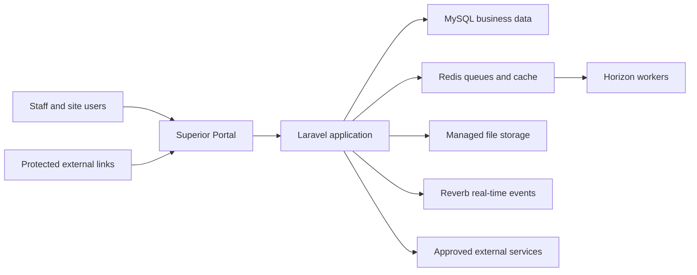

  

<h1 align="center">Superior Portal</h1>

<strong>A unified construction operations platform for Superior Group</strong>

  
  

## About the portal

Superior Portal—originally developed as DPC Clock—is Superior Group's central platform for workforce, project, commercial, safety, and compliance operations.

The published application replaces disconnected spreadsheets and manual processes with permission-controlled workflows, shared project data, real-time reporting, digital approvals, and auditable records. It is designed for office teams, project managers, site supervisors, employees, and authorised external participants.

## Accessing the published application

Superior Portal is an internal business system. Access is issued by a system administrator and each user sees only the areas permitted by their assigned role.

- Staff sign in with their authorised account or passkey.
- Site employees can use a registered kiosk or approved QR workflow.
- External participants use time-limited or token-protected links for specific forms, signatures, or acknowledgements.
- New access, password assistance, and permission changes should be requested through the organisation's system administrator.

The production address is intentionally not stored in this public-facing repository documentation. Use the approved Superior Group bookmark or contact an administrator for the current URL.

## What the platform does

### Workforce and timekeeping

- Employee records, employment documents, transfers, and onboarding
- Project kiosks, PIN validation, clock-in and clock-out workflows
- Timesheets, allowances, work types, missing sign-out reports, and reconciliation
- Employment Hero payroll synchronisation and variance reporting

### Projects and delivery

- Project setup, teams, cost codes, schedules, and production data
- Labour forecasts, job forecasts, turnover forecasts, WIP, and cash forecasting
- Drawing registers, revisions, observations, measurements, and take-offs
- Production tracking, budgets, progress data, and project dashboards

### Commercial and purchasing

- Requisitions, approval workflows, suppliers, materials, and project price lists
- Purchase-order generation, Premier integration, comparisons, and insights
- Variations, pricing, retention, GL reporting, and credit-card receipts
- Budget-versus-actual and labour-cost reporting

### Safety and compliance

- Daily pre-starts, SWMS, toolbox talks, and digital worker sign-on
- Injury reporting, PPE/RPE issue registers, SDS, and silica registers
- Training, screening, checklists, WHS reports, and compliance dashboards
- QR-accessible site workflows with throttling and project controls

### Documents and communication

- Reusable form and document templates
- Token-protected document signing and batch signing
- Employment applications and reference-check workflows
- Notifications, web push, SMS, email, and short links

### Reporting and assistance

- Role-specific dashboards and operational reports
- Superior AI chat, voice, extraction, and guided workflows where enabled
- Automated document, receipt, drawing, and data processing
- Feature flags for controlled rollouts and staged releases

## Roles and permissions

The application uses role-based access control. Navigation, records, actions, and reports are filtered according to the signed-in user's permissions and project responsibilities.

Typical access profiles include:

| User group | Typical access |
| --- | --- |
| Administrators | Users, roles, configuration, feature flags, queues, and all business modules |
| Finance and commercial teams | Purchasing, forecasts, variations, GL reports, receipts, and Premier data |
| Project teams | Assigned projects, labour, drawings, production, schedules, safety, and requisitions |
| Safety and compliance teams | WHS workflows, registers, employee compliance, reporting, and document control |
| Site employees | Kiosk timekeeping and approved site sign-on workflows |
| External participants | Only the form or signing workflow associated with a protected link |

Actual permissions may differ by role and are managed centrally.

## Published architecture

The production application is built with Laravel 13, Inertia 3, React 19, TypeScript, Vite, and Tailwind CSS. MySQL stores operational data, Redis supports queues and caching, Horizon processes background work, and Reverb delivers real-time browser events.

## Connected services

Integrations are enabled only where configured and authorised.

| Service | Use in Superior Portal |
| --- | --- |
| Employment Hero | Employee, payroll, and timesheet synchronisation |
| Premier | Purchase orders, commitments, GL, project, and financial data |
| AWS | Managed file storage and drawing metadata extraction |
| Google services | Address lookup, geocoding, maps, and weather data |
| ClickSend | Operational SMS messages and signing links |
| OpenAI and Anthropic | Approved AI-assisted workflows |
| Computer-vision service | Deterministic drawing revision comparison |
| Reverb and web push | Live updates and browser notifications |

## Security and data handling

- Authenticated areas require an active user account and applicable permissions.
- Public workflows use scoped tokens or short links and request throttling.
- Sensitive actions are validated server-side and recorded where auditing applies.
- Passkeys, one-time passwords, and account controls are available for supported workflows.
- Secrets and production credentials are supplied by the deployment environment and are not stored in the repository.
- Users must handle employee, safety, commercial, and project information in accordance with Superior Group policies.

If a link, account, or record appears to expose information unexpectedly, stop using it and report the issue to the system administrator.

## Availability and support

Planned maintenance may temporarily display a maintenance page. Background processing, external-service outages, or large document jobs can also delay updates without making the main portal unavailable.

When reporting a problem, include:

1. The page or feature being used
2. The project, employee, requisition, or document involved
3. What was expected and what happened
4. The approximate time of the issue
5. A screenshot, excluding passwords, tokens, and confidential information not needed for diagnosis

Do not include credentials, passkeys, API keys, or full protected-link URLs in support messages.

## Release and deployment

Changes merged to `main` pass automated backend tests, frontend compilation, formatting, and lint checks before production deployment. The release workflow then:

1. Installs production dependencies and builds frontend assets
2. Places the application briefly into maintenance mode
3. Applies database migrations and synchronises roles and permissions
4. Warms application caches
5. Restarts background workers and real-time services
6. Reloads the PHP application and returns the portal to service

This process keeps normal releases repeatable while limiting user-facing downtime.

## Product documentation

- [API documentation](docs/api.md)
- [Premier data model](docs/PREMIER_DATA_MODEL.md)
- [Drawing extraction and comparison](docs/drawing-extraction-setup.md)
- [OST import](docs/ost-import.md)
- [Project dashboard guide](docs/project-dashboard-guide.md)
- [Production tab guide](docs/production-tab.md)
- [React Native schedule application](docs/rn-schedule-app.md)

## Repository

This repository contains the application source, database migrations, automated tests, deployment configuration, and feature documentation for the published Superior Portal.

The system is maintained for Superior Group's operational use. Product access does not grant access to the source repository, and repository access does not grant access to production data.
